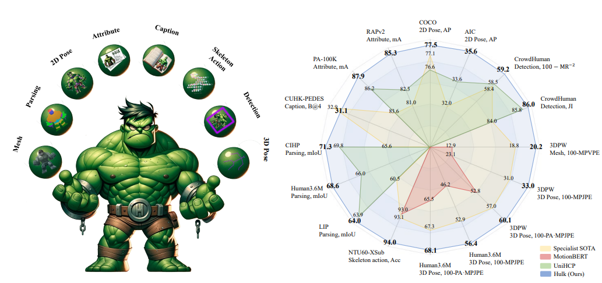
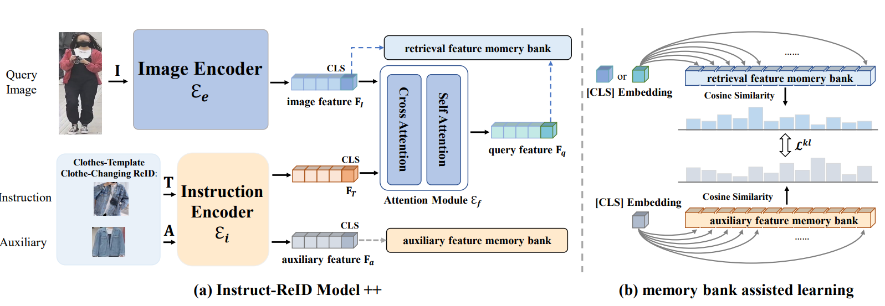
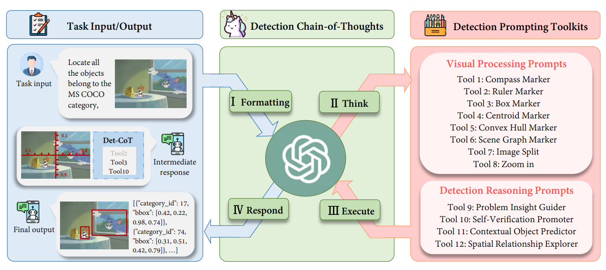
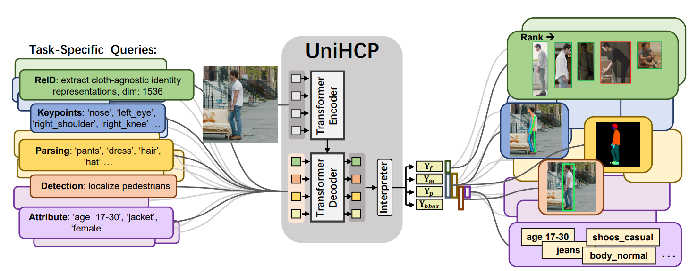
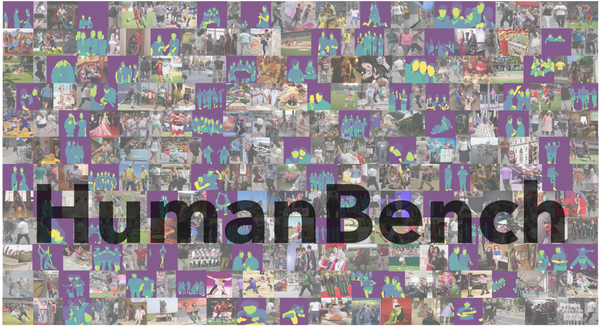
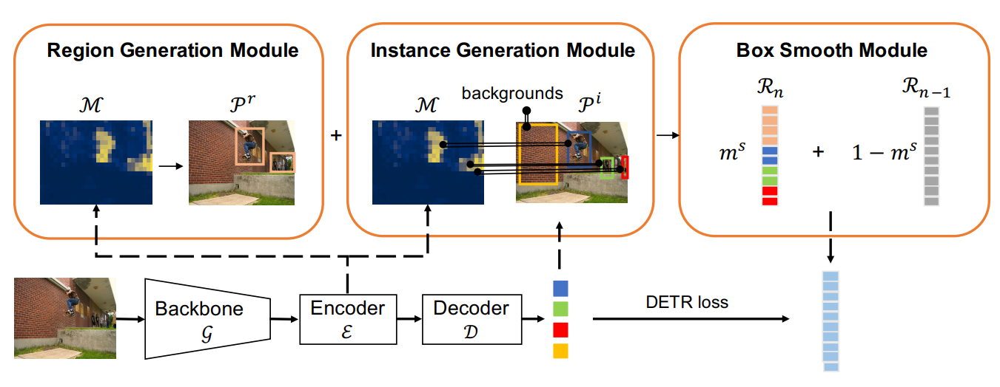
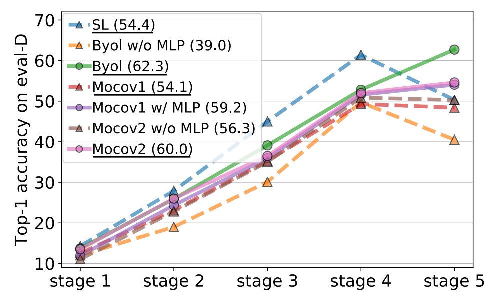








I am a second-year Ph.D. student at MMLab, The Chinese University of Hong Kong, supervised by Prof. [Wanli Ouyang](https://wlouyang.github.io/). 
Before that, I received Master's degree in 2023 and Bachelor's degree in 2020 from [Zhejiang University](https://www.zju.edu.cn/english/).

My research interest includes computer vision and multimodal foundation models. I have published multiple research works on representation learning, human-centric perception tasks. My focus now spans world models for egocentric vision and scientific multimodal foundation models.

Reach out to me via [email](wy024@ie.cuhk.edu.hk) for discussion or any opportunities.

# 🔥 News
- *2025.09*: &nbsp; As the student project lead, I directed the development of [SciReasoner](https://arxiv.org/pdf/2509.21320), a scientific reasoning foundation model that explicitly elicits scientific reasoning and supports five capability families with up to 103 tasks. The model, instruct tuning datasets and the evaluation code are open-sourced at [huggingface](https://huggingface.co/SciReason) and [github](https://github.com/open-sciencelab/SciReason).
- *2025.06*: &nbsp; [EgoAgent](https://arxiv.org/pdf/2502.05857) and [CMT](https://arxiv.org/pdf/2504.20830) are accepted by ICCV 2025.
- *2025.05*: &nbsp; We will host the [1st Workshop on Interactive Human-centric Foundation Models](https://i-hfm-2025.github.io/I-HFM-2025/) at ICCV 2025, Honolulu, HI, USA.
- *2025.03*: &nbsp; A survey about [Human-Centric Foundation Models](https://arxiv.org/pdf/2502.08556) is accepted by IJCAI 2025.
- *2025.03*: &nbsp; [Hulk](https://arxiv.org/pdf/2312.01697) is accepted by TPAMI.
- *2025.02*: &nbsp; [Instruct-ReID++](https://arxiv.org/pdf/2405.17790) is accepted by TPAMI.
- *2025.02*: &nbsp; We release a [survey paper](https://arxiv.org/pdf/2502.08556) on human-centric foundation models.
- *2024.08*: &nbsp; I join MMLab, CUHK as a Ph.D. student.
- *2024.07*: &nbsp; [Dettoolchain](https://arxiv.org/pdf/2403.12488) is accepted by ECCV 2024.
- *2024.03*: &nbsp; [Instruct-ReID](https://openaccess.thecvf.com/content/CVPR2024/papers/He_Instruct-ReID_A_Multi-purpose_Person_Re-identification_Task_with_Instructions_CVPR_2024_paper.pdf) is accepted by CVPR 2024.
- *2023.03*: &nbsp; [UniHCP](https://openaccess.thecvf.com/content/CVPR2023/papers/Ci_UniHCP_A_Unified_Model_for_Human-Centric_Perceptions_CVPR_2023_paper.pdf) and [HumanBanch](https://openaccess.thecvf.com/content/CVPR2023/papers/Tang_HumanBench_Towards_General_Human-Centric_Perception_With_Projector_Assisted_Pretraining_CVPR_2023_paper.pdf) are accepted by CVPR 2023.
- *2022.09*: &nbsp; One paper is accepted by NeurIPS 2022.
- *2022.07*: &nbsp; I am named as one of the Outstanding Reviewers of ICML 2022.
- *2022.07*: &nbsp; One paper is accepted by ECCV 2022.
- *2022.03*: &nbsp; One paper is accepted by CVPR 2022.

# 📝Selective Publications 
(* equal contribution)

Tech Report

[SciReasoner: Laying the Scientific Reasoning Ground Across Disciplines](https://arxiv.org/pdf/2509.21320)

**Yizhou Wang**, Chen Tang, Han Deng, Jiabei Xiao, Jiaqi Liu, Jianyu Wu, Jun Yao, Pengze Li, Encheng Su, Lintao Wang, Guohang Zhuang, Yuchen Ren, Ben Fei, Ming Hu, Xin Chen, Dongzhan Zhou, Junjun He, Xiangyu Yue, Zhenfei Yin, Jiamin Wu, Qihao Zheng, Yuhao Zhou, Huihui Xu, Chenglong Ma, Yan Lu, Wenlong Zhang, Chunfeng Song, Philip Torr, Shixiang Tang, Xinzhu Ma, Wanli Ouyang, Lei Bai

[pdf](https://arxiv.org/pdf/2509.21320)/[code](https://github.com/open-sciencelab/SciReason)/[data and model](https://huggingface.co/SciReason)

TPAMI 2025

[Hulk: A universal knowledge translator for human-centric tasks](https://arxiv.org/pdf/2312.01697)

**Yizhou Wang**, Yixuan Wu, Shixiang Tang, Weizhen He, Xun Guo, Feng Zhu, Lei Bai, Rui Zhao, Jian Wu, Tong He, Wanli Ouyang

[project](https://humancentricmodels.github.io/Hulk/)/[pdf](https://arxiv.org/pdf/2312.01697)/[code](https://github.com/OpenGVLab/Hulk)

TPAMI 2025

[Instruct-ReID++: Towards Universal Purpose Instruction-Guided Person Re-identification](https://arxiv.org/pdf/2405.17790)

Weizhen He, Yiheng Deng, Yunfeng Yan, Feng Zhu, **Yizhou Wang**, Lei Bai, Qingsong Xie, Rui Zhao, Donglian Qi, Wanli Ouyang, Shixiang Tang

[pdf](https://arxiv.org/pdf/2405.17790)/[code](https://github.com/hwz-zju/Instruct-ReID)

ECCV 2024

[Dettoolchain: A new prompting paradigm to unleash detection ability of mllm](https://arxiv.org/pdf/2403.12488)

Yixuan Wu*, **Yizhou Wang***, Shixiang Tang, Wenhao Wu, Tong He, Wanli Ouyang, Philip Torr, Jian Wu 

[pdf](https://arxiv.org/pdf/2403.12488)/[code](https://github.com/yixuan730/DetToolChain)

CVPR 2023

[Unihcp: A unified model for human-centric perceptions](https://openaccess.thecvf.com/content/CVPR2023/papers/Ci_UniHCP_A_Unified_Model_for_Human-Centric_Perceptions_CVPR_2023_paper.pdf)

Yuanzheng Ci*, **Yizhou Wang***, Meilin Chen, Shixiang Tang, Lei Bai, Feng Zhu, Rui Zhao, Fengwei Yu, Donglian Qi, Wanli Ouyang

[pdf](https://openaccess.thecvf.com/content/CVPR2023/papers/Ci_UniHCP_A_Unified_Model_for_Human-Centric_Perceptions_CVPR_2023_paper.pdf)/[code](https://github.com/OpenGVLab/UniHCP)

CVPR 2023

[Humanbench: Towards general human-centric perception with projector assisted pretraining](https://openaccess.thecvf.com/content/CVPR2023/papers/Tang_HumanBench_Towards_General_Human-Centric_Perception_With_Projector_Assisted_Pretraining_CVPR_2023_paper.pdf)

Shixiang Tang, Cheng Chen, Qingsong Xie, Meilin Chen, **Yizhou Wang**, Yuanzheng Ci, Lei Bai, Feng Zhu, Haiyang Yang, Li Yi, Rui Zhao, Wanli Ouyang

[pdf](https://openaccess.thecvf.com/content/CVPR2023/papers/Tang_HumanBench_Towards_General_Human-Centric_Perception_With_Projector_Assisted_Pretraining_CVPR_2023_paper.pdf)/[code](https://github.com/OpenGVLab/HumanBench)

NeurIPS 2022

[Unsupervised object detection pretraining with joint object priors generation and detector learning](https://proceedings.neurips.cc/paper_files/paper/2022/file/50ca96a1a9ebe0b5e5688a504feb6107-Paper-Conference.pdf)

**Yizhou Wang***, Meilin Chen*, Shixiang Tang, Feng Zhu, Haiyang Yang, Lei Bai, Rui Zhao, Yunfeng Yan, Donglian Qi, Wanli Ouyang

[pdf](https://proceedings.neurips.cc/paper_files/paper/2022/file/50ca96a1a9ebe0b5e5688a504feb6107-Paper-Conference.pdf)

CVPR 2022

[Revisiting the Transferability of Supervised Pretraining: an MLP Perspective](https://openaccess.thecvf.com/content/CVPR2022/papers/Wang_Revisiting_the_Transferability_of_Supervised_Pretraining_An_MLP_Perspective_CVPR_2022_paper.pdf)

**Yizhou Wang***, Shixiang Tang*, Feng Zhu, Lei Bai, Rui Zhao, Donglian Qi, Wanli Ouyang

[pdf](https://openaccess.thecvf.com/content/CVPR2022/papers/Wang_Revisiting_the_Transferability_of_Supervised_Pretraining_An_MLP_Perspective_CVPR_2022_paper.pdf)

# 🎖 Honors and Awards
- *2023.03* Excellent Postgraduate of Zhejiang University.
- *2023.03* Youxian Sun Scholarship (Top 1 in the Master’s class of College of Electrical Engineering)
- *2022.07* **Outstanding Reviewers** of ICML 2022.

# 📖 Educations
- *2023.09 - Now*, Ph.D., The Chinese University of Hong Kong, Hong Kong SAR, China.
- *2020.09 - 2023.03*, Master, Zhejiang University, Hangzhou, China.
- *2016.09 - 2020.06*, Undergraduate, Zhejiang University, Hangzhou, China.

[//]: # (# 💬 Invited Talks)

[//]: # (- *2021.06*, Lorem ipsum dolor sit amet, consectetur adipiscing elit. Vivamus ornare aliquet ipsum, ac tempus justo dapibus sit amet. )

[//]: # (- *2021.03*, Lorem ipsum dolor sit amet, consectetur adipiscing elit. Vivamus ornare aliquet ipsum, ac tempus justo dapibus sit amet.  \| [\[video\]]&#40;https://github.com/&#41;)

# 💻 Internships
- *2023.01 - Now*, Shanghai AI Laboratory, China.
- *2021.03 - 2022.12*, SenseTime, China.